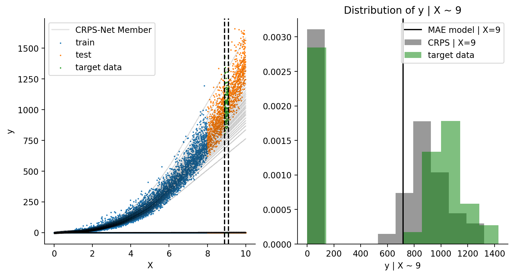

Complete forecasts (predictions) demonstrated using CRPS-Net
============================================================

Why bother with estimating prediction uncertainty?
--------------------------------------------------

Properly accounting for uncertainty can lead to better decision making.
For example, imagine you are a grower and you know that you have a hard
time working in your field due to mud if it rains more than 2 inches in
24 hours. If you were to use a deterministic forecast (single predicted
value, like what you probably see on your phone’s default weather app)
to figure out if you will be able to work in your fields tomorrow and
the forecast is calling for 1.4 inches of rain you might think you were
good to go. However, in the back of your head you know that weather
forecasts can be wrong (as an atmospheric scientist I am sorry about
this, there are lots of reasons for this that I do not have time to get
into right now. If you are curious,
`here <https://www.ecmwf.int/en/research/modelling-and-prediction/quantifying-forecast-uncertainty>`__
is a good resource to learn more about this). Often times people do some
kind of three dimensional chess in their heads and think things like,
“O.K. the weather app says it is going to rain 1.4 inches, historically
I know that could mean anywhere between 0.1 and 3 inches of rain might
fall.” Wouldn’t it be handy if the forecasting system was transparent
about how confident it was in its own prediction and did this for you?
What if instead of a forecast for 1.4 inches of rainfall, the
forecasting system was able to tell you 1.4 inches with a 60% chance of
exceeding 2 inches. With this forecast, making plans to work in the
field tomorrow suddenly seems less full proof, *i.e.* the decision is
not so cut and dry (bazinga). Now imagine that the forecast two days
from now gave only a 5% chance of more than two inches of rain. If you
had confidence in the forecasting system you would probably decide to
work in the field the day the chance of mud was lower. If you were to
play out this scenario hundreds of times and the forecast probabilities
were reliable (*see note on reliability below) (meaning events that were
given some X% chance to occur actually occurred X% of those times, for
all percentages), the grower that made decisions using this system would
save lots of time.

.. image:: resources/muddy_field.png
    :width: 800
    :align: center
    :target: https://www.geograph.org.uk/photo/2132503

Muddy fields can be extremely challenging for growers to work in. `Photo credit. <https://www.geograph.org.uk/photo/2132503>`__

The value of these kinds of predictions has long been established in the
field of `Numerical Weather Prediction
(NWP) <https://www.ncdc.noaa.gov/data-access/model-data/model-datasets/numerical-weather-prediction>`__
(e.g. `1 <https://www.ecmwf.int/sites/default/files/elibrary/2012/14557-ecmwf-ensemble-prediction-system.pdf>`__,
`2 <https://journals.ametsoc.org/view/journals/mwre/146/5/mwr-d-17-0250.1.xml>`__,
`3 <https://towardsdatascience.com/probabilistic-predictions-fe04214bde48>`__).
The same principals that make them useful in the weather prediction
domain (:math:`i.e.` weather forecasting) apply to predictions made
using Machine Learning (hereafter ML) models. `Buizza
2008 <https://rmets.onlinelibrary.wiley.com/doi/10.1002/asl.170>`__
states some of these benefits with great brevity and clarity (simply
interchange ML-based predictions for weather forecasts to see the
broader benefit). They state, “Probabilistic forecasts (predictions)
designed to estimate the probability density function of forecast
(prediction) states are potentially more valuable than single forecasts
(predictions) because (1) they can predict not only the most likely
outcome but also the probability of occurrence of extreme and rare
events”. In other words, a (good) probabilistic prediction reliably
represents the true uncertainty of a given forecasting system, and
transparently conveys the whole range of possible outcomes (I like to
also call this a *complete forecast*). In the weather forecasting
domain, sources of uncertainty include not knowing the true state of the
atmosphere before integrating (forward in time) the so-called `physical
equations <https://en.wikipedia.org/wiki/Primitive_equations>`__ of the
atmosphere (also imperfect) to make future predictions (`many more
details
here <https://www.ecmwf.int/sites/default/files/elibrary/2012/14557-ecmwf-ensemble-prediction-system.pdf>`__).
In Machine learning, sources of uncertainty may include flawed or
incomplete features to properly map the feature space to the target
variable, numerical roundoff, bias-variance tradeoffs, not enough data,
not converging on the optimal loss function minima while training,
:math:`etc`\ …

Luckily CRPS-Net can help! CRPS-Net makes it easy to make predictions
that reliably portray the :math:`range` of possible outcomes
(:math:`y_{pred}` as a probability density function) rather than a
single point estimate. What are the downsides? None! Well, close
anyways. The most common opposition to probabilistic predictions are
that they are 1) Hard to interpret and 2) computationally expensive.
CRPS-Net and Ensemble, both of which will be demonstrated by this
notebook, help to overcome these barriers.

\*\ **Quick Note on reliability:** Probability forecasts are considered
reliable when, evaluated over many cases, forecast probability (p)
matches the observed relative frequency. What? This means a forecasting
system is reliable if it rains 10% of the time a forecasting system
calls for a 10% chance of rain. Somewhat annoyingly this means you need
to wait around a while before saying, “the forecast was wrong!”. Also
somewhat annoyingly, this means you do not get to say, “the forecast was
wrong” if a 51% chance of rain was predicted and no rain occurred.
Probabilities are not winner takes all elections. If it rained 51/100
times a 51% chance of rain was given, the forecast was perfect! This is
often measured using a `verification rank
histogram <https://journals.ametsoc.org/view/journals/mwre/129/3/1520-0493_2001_129_0550_iorhfv_2.0.co_2.xml>`__.

**Fun aside:** Usually when you see “% chance of rain” from some
forecasting system it is referring to 0.01 inches of rain occurring in
some time period. It has nothing to do with precipitation quantity. A
90% chance of rain does not mean more rain than 50%, just a higher
chance of 0.01 inches.

Getting started with CRPS-net
-----------------------------

The rest of this notebook is dedicated to demonstrating what CRPS-Net is
and how it can be usefull for making complete non-parametric
predictions. Following the code requires only a basic understanding of
python, neural networks, and TensorFlow.

Python Prerequisites
~~~~~~~~~~~~~~~~~~~~

-  ensemble
-  tensorflow
-  sklearn

.. code-block:: python

    # Load standard ML resources from sklearn
    from sklearn.model_selection import train_test_split
    from sklearn.preprocessing import MinMaxScaler, StandardScaler
    
    # Import deep learning resources, I like TensorFlow
    import tensorflow as tf
    import tensorflow.keras as K
    from tensorflow.keras.layers import Input, Dense, Activation, Concatenate
    from tensorflow.keras.callbacks import EarlyStopping
    
    # Finally, import regular scientific python resources
    import numpy as np
    import pandas as pd
    import matplotlib.pyplot as plt
    import seaborn as sns
    import os
    import sys
    import warnings
    
    # Import functions specifically cooked up for this notebook
    import sys
    from ensemble.demo_data import create_point_gamma_data
    
    # TODO: This will be importing our Github hosted package after showing 
    # TODO: how to install at the command line
    
    from ensemble.crps_net import crps_sample_score

Create synthetic data that would be hard to make useful predictions of using standard regression techniques
~~~~~~~~~~~~~~~~~~~~~~~~~~~~~~~~~~~~~~~~~~~~~~~~~~~~~~~~~~~~~~~~~~~~~~~~~~~~~~~~~~~~~~~~~~~~~~~~~~~~~~~~~~~

These data are a combination of a point-mass distribution stuck at zero
and a gamma function increasing with arbitrary feature X. The different
branches of these target data present a challenge to make a meaningful
prediction using many standard loss functions such as mean absolute
error or mean squared error.

.. code-block:: python

    X, y = create_point_gamma_data(
        n_examples=10000, 
        x_min=0.0, 
        x_max=10., 
        point_mass_value=0,
        point_mass_proportion=0.5
    )

.. code-block:: python

    f=plt.figure(dpi=150)
    plt.title("Tricky Synthetic Data")
    plt.scatter(X, y, alpha=0.5, marker=".")
    plt.ylabel("y (some target data)")
    plt.xlabel("X (some feature)")
    sns.despine()
    plt.show()

The plot above shows there is clearly a relationship between X and y.
Some obvious characteristics of the target and feature space is the
target data stuck at 0 (invariant of X) and the exponential looking bit.
It also looks like the spread in the exponential looking part increases
with increasing X.

An example of real-life data that may look like this is the relationship
between predicted (forecast) precipitation (rain) and observed rain.
:math:`i.e.`, there are many possible outcomes (y) for a given set of
information (features) used to predict rainfall (X). In general, there
is always a chance that no rain occurs even if a large amount is
possible and a gamma function can be useful to represent this type of
characteristic `if you are curious about this particular problem check
out these
papers <https://journals.ametsoc.org/view/journals/wefo/30/2/waf-d-14-00054_1.xml>`__.

Lets train a couple of simple neural networks and see which one seems
more useful trying to predict y using X.

.. code-block:: python

    def build_simple_network(
        input_shape=1, 
        n_members=10, 
        neurons=100,
        output_activation='linear',
        loss="mae",
        model_name = "model_McModelFace",
        lr=0.001,
        compile_model=True
    ):  
        """
        Simple neural network that outputs "ensemble" members that are
        meant to represent an equally likely estimate of the target. 
        Can learn any distribution when trained with CRPS loss. Fully
        connected layers with leaky_relu activation. 
        
        Parameters
        ----------
        input_shape : int, default=1
            The number of features for training
        n_members : int, default=10
            The number of ensemble estimates to use to estimate the target. 
            should be 1 unless loss is crps_sample_score()
        neurons : int
            The number of nodes in each hidden layer
        output_activation : str or tf.nn.activation_function
            The activation function used on the output layer. 
        loss : str or function, default="mae"
            The loss function for the network
        model_name : str, default="model_McModelFace"
            The name of the returned model
        lr : float, default=0.001
            model learning rate
        compile_model : bool, default=True
            Whether to compile model before returning 
            
        Return
        ------
        tensorflow.keras.Model
        """
    
        inputs = Input(shape=(input_shape,))
    
        # Create the hidden layers 
        x = Dense(neurons, activation=tf.nn.leaky_relu, name="L1")(inputs)
        x = K.layers.Dropout(0.05)(x)
        x = Dense(neurons, activation=tf.nn.leaky_relu, name="L2")(x) 
        x = K.layers.Dropout(0.05)(x)
        x = Dense(neurons, activation=tf.nn.leaky_relu, name="L3")(x) 
        
        # Create the distribution parameters---
        outputs = Dense(n_members, activation=output_activation, name="ensemble_members")(x)
        
        model = K.Model(inputs=inputs, outputs=outputs, name=model_name)
        
        if compile_model : 
            
            opt = tf.keras.optimizers.Adam(learning_rate=lr)
            model.compile(loss=loss, optimizer=opt)
    
        return model

.. code-block:: python

    # Split up the data for training and "testing"
    # TODO: We are going to play fast and loose with test and validation data in this notebook, 
    # TODO: for ease of demonstration purposes
    X_train, X_test, y_train, y_test = train_test_split(X, y, test_size=0.3, random_state=10, shuffle=True) 

Train the simple models
~~~~~~~~~~~~~~~~~~~~~~~

Train a model with mean absolute error as a loss function and
crps_sample_score as a loss function. We will go into the details of the
CRPS loss function in a bit.

.. code-block:: python

    tf.keras.backend.clear_session()
    
    # The conditions of early stopping. For callbacks arg in .fit method
    monitor = EarlyStopping(
        monitor='val_loss', 
        min_delta=0.0, 
        patience=4, 
        verbose=1, 
        mode='auto', 
        restore_best_weights=True
    )
    
    # Create a model with a mean absolute error loss function 
    mae_model = build_simple_network(
        input_shape=1, 
        n_members=1, 
        neurons=30,
        output_activation='linear',
        loss="mae",
        model_name = "mae_model",
    )
    
    # Train it! 
    mae_model.fit(
        x=X_train, 
        y=y_train,
        epochs=100,
        validation_data=(X_test, y_test),
        callbacks=[monitor],
        batch_size=128,
        verbose=1
    )
    
    
    # Build/Train CRPS-net model. We will dig into the details of 
    # crps_sample_score in just a minute.
    # NOTE: n_members is the number of predictions made by the model
    crps_net = build_simple_network(
        input_shape=1, 
        n_members=51, 
        neurons=30,
        output_activation='linear',
        loss=crps_sample_score,
        model_name = "crps-net"
    )
    
    crps_net.fit(
        x=X_train, 
        y=y_train,
        epochs=100,
        validation_data=(X_test, y_test),
        callbacks=[monitor],
        batch_size=128,
        verbose=1
    )

Side by side results: CRPS-Net vs. MAE model
~~~~~~~~~~~~~~~~~~~~~~~~~~~~~~~~~~~~~~~~~~~~

Since it is hard to show a scatter plot of multiple predictions vs. what
occurs, I will show predictions across the range of X_test (more
rigorous evaluations of these predictions will be made later). Before
digging into the predictions too much, I would like to note that
CRPS-Net took ~3ms per step vs. the MAE model’s ~2ms. This is slower for
sure, but not much slower. It will be up to you to decide if the rewards
are worth it!

.. code-block:: python

    # Make predictions across the range of the feature X
    x_span = np.expand_dims(np.linspace(np.min(X), np.max(X), 1000), 1)
    
    # Predict with both models
    mae_pred = mae_model.predict(x_span)
    crps_net_pred = crps_net.predict(x_span)

.. code-block:: python

    # NOTE: the predictions of CRPS-net are a bit funky 
    # NOTE: compared to most regression-like loss functions. 
    # This post is going to spend a lot of time going over how to use this output
    # dim = [example, pseudo ensemble member]
    crps_net_pred.shape

.. parsed-literal::

    (1000, 51)

.. code-block:: python

    fig = plt.figure(dpi=160)
    
    plt.scatter(X_test, y_test, c="gray", alpha=0.8, label="test data")
    
    # Since there is more than one predicted outcome per set of features
    # plotting crps-net predictions requires additional care 
    for member in range(crps_net_pred.shape[1]) : 
        plt.scatter(
            x_span, crps_net_pred[:, member], 
            c="C0", alpha=0.2, s=0.2, marker="."
        )
    # Add this just to get the legend for the members 
    plt.scatter(
        x_span, crps_net_pred[:, member], 
        c="C0", alpha=0.0, s=0.2, marker=".", label="CRPS-Net Member"
    )
        
    # Show the mean of the CRPS-net prediction also by taking the mean across members
    plt.plot(
        x_span, crps_net_pred.mean(axis=1), c="C0", alpha=1, label="CRPS-Net Mean"
    )
    plt.plot(x_span, mae_pred, label="mae-model", c="C1")
    plt.xlabel("X")
    plt.ylabel("y")
    plt.title("Test Data and model predictions across X")
    sns.despine()
    plt.legend()
    
    plt.show()

Before we move onto metrics for assessing the possible value of these
predictions lets first point out some of the stuff happening in the
above plot.

-  The MAE-model predictions (orange) tracks the gamma component of the
   data nicely and clearly demonstrates how a simple neural network can
   easily learn a non-linear relationship.
-  The MAE-model does not give you any information about the persistent
   target data (half in this case) stubbornly stuck at zero. It never
   predicts this value, even though it is half of the outcomes. Not
   ideal. It also does not easily give you any information about how the
   spread in y increases (a lot) with increasing X.
-  CRPS-net captures both branches of the target data. It even seems to
   capture how the spread in possible outcomes of y increases with
   increasing X.
-  The density of CRPS-net model predictions seems to match the density
   of outcomes in the target data. The model seems to minimize the
   distance between the examples in the target data and the predicted
   ensemble members.
-  Neither make predictions where there are no target data, nice.
-  I have plotted the mean of the CPRS-net model predictions as
   reference and to show those that may be resistance to using multiple
   outputs as predictions that this can be an option, though you lose
   much of the value of CRPS-net, which I hope you better outline below.

Introduction to the Continuous Ranked Probability Score (CRPS)
--------------------------------------------------------------

“CRPS” has been thrown around a lot so far without giving a formal
definition yet. Sorry, I just wanted to make sure you were hooked before
dropping some equations. The CRPS was invented to enable direct
comparisons of deterministic (single value) and probabilistic
predictions. It is the analog of mean absolute error for multiple
equally likely predictions. The formal definition is,

.. math:: CRPS=\int_{-\infty}^{\infty} (F(y) - \textbf{1}|y \geq x|)^2 dy

Where F is the predicted cumulative density function (CDF), y is a
random variable, and x is the observed value, and :math:`\textbf{1}` is
the `heaviside
function <https://en.wikipedia.org/wiki/Heaviside_step_function>`__,
which is equal to one where F(y) is greater than x and 0 elsewhere. This
equation is easier to think about when represented graphically.
Graphically, the CRPS is the area between the prediction CDF and the
observed outcome CDF. This is sketched graphically below, first for a
deterministic prediction, then a probabilistic prediction, and finally,
a comparison of the two.

The bottom of the above figure compares the CRPS (the same units as the
predicted variable) for the point prediction and the probabilistic
prediction shown as a CDF. For this very professional but still leaves
something to be desired sketch, it is not clear which area is smaller,
but you get the idea! This shows how the CRPS is useful for making
direct comparisons of point predictions and probabilistic predictions.
For a very thorough overview of CRPS, take a look at `this
paper <https://sites.stat.washington.edu/raftery/Research/PDF/Gneiting2007jasa.pdf>`__.

Note on Mixture Density Networks
~~~~~~~~~~~~~~~~~~~~~~~~~~~~~~~~

Mixture density networks can make these types of probabilistic
predictions (e.g. blue CDF above) by predicting the moments of a
predicted distribution (e.g. normal distribution :math:`\mu` and
:math:`\sigma`). There is `a great blog
post <https://github.com/oborchers/Medium_Repo>`__ that walks you
through doing this. However, one of the weaknesses of mixture density
networks is that you need to define F a priori in order to predict the
moments of F. This can be a hassle if you do not know the ideal
distribution, if a complex mix of distributions is needed, or if you
want to train a single model for many applications. To make the
predictions nonparametric we want to get rid of having to define
:math:`F` above. There are papers that measure the CRPS of predictions,
but to date, only for distributions defined a priori
(`e.g. <https://journals.ametsoc.org/view/journals/mwre/146/11/mwr-d-18-0187.1.xml>`__).
There is an alternative form of the CRPS that lets us accomplish this!

CRPS-Net: Detailed description
~~~~~~~~~~~~~~~~~~~~~~~~~~~~~~

O.K. lets go over the mathematical backbone of CRPS-Net. The desired
probabilistic neural network output :math:`\hat{Y}` is a matrix with
dimensions number of examples (N) by number of predictions per example
(G) and can be defined with the following mathematical notation:

.. math:: \hat{Y}=f(\bf{X}; \Theta)

Where f(ᐧ) is a neural network, :math:`\bf{X}` is a N x P matrix of P
(integer) input features, :math:`\Theta` is a set of parameters defining
the neural network architecture (e.g. {number of hidden layers, nodes in
layers, activation functions} ∈ :math:`\Theta`), and where G ∈ ϴ is an
integer specifying the network output size 1 X G for a given prediction
:math:`\hat{Y}_i`.

For a given :math:`\hat{Y}_i` of size 1 X G, each of the G predicted
values can be treated as an equally likely prediction of the target
variable y. In other words, :math:`\hat{Y}_i` can be treated as a random
sample of the target variable (y) distribution for the given set of
input features :math:`\bf{X_i}`. This interpretation of :math:`\hat{Y}`
is only valid when G is sufficiently large to portray the distribution
of y for a given :math:`\bf{X}` and f(ᐧ) is trained using the
sampled-based version of the Continuous Ranked Probability Score (CRPS)
as its loss function.

.. math:: CRPS(\hat{Y}, y) = E_F|\hat{Y} - y| - 1/2 \times E_F|\hat{Y} - \hat{Y}^{\prime}|

Where :math:`{\hat{Y}^\prime}` is an independent transposed copy of
:math:`\hat{Y}` and E represents the expected value function. The first
term represents the mean absolute error between the f(ᐧ) predictions
:math:`\hat{Y}` and the target variable y. The second term is half the
mean absolute value of the pairwise difference of all predicted values
for a given example (spread in predictions for a given example). When
f(ᐧ) is configured such that G=1, the second term in the CRPS is equal
to zero and the neural network behaves identically to a neural network
trained with the mean absolute error loss function. These are the key
network requirements for CRPS-Net. The rest of the network parameters
:math:`\Theta` and choices for training and optimising can vary widely
and retain the same properties for :math:`\hat{Y}`.

This neural network framework can completely replace the need for
learning the moments of a hypothesized target distribution, as the G
predictions for a given :math:`\hat{Y}_i` can be treated as a random
sample of the predictand distribution. For example, say :math:`\bf{X}`
and y are related by a physical process, but due to limited resolution
of predictor observations :math:`\bf{X}`, :math:`y_i` is observed to
take on any value from a normal distribution with parameters :math:`\mu`
and :math:`\sigma` for a given predictor :math:`\bf{X_i}`. The mean and
standard deviation of :math:`\hat{Y}_i` from :math:`f(\bf{X_i, \Theta})`
can be viewed as sample estimates of the population parameters
:math:`\mu` and :math:`\sigma`. The larger G, the more accurate these
sample estimates of the population parameters become. This
interpretation can generalize to any parametric or observed distribution
and has been tested on many, including gamma, point-mass, normal,
tweedie, truncated normal, exponential, mixtures of these, and other
synthetic mixtures.

Simple metrics
~~~~~~~~~~~~~~

The next section will score the above model predictions and show some of
the utility/value of the CRPS-net model predictions.

.. code-block:: python

    from sklearn.metrics import mean_absolute_error
    from properscoring import crps_ensemble

.. code-block:: python

    target = np.array(2, dtype=np.float32).reshape(-1, 1)
    point_prediction = np.array(3, dtype=np.float32).reshape(-1, 1)
    
    print("Mean abolute Error: ", mean_absolute_error(target, point_prediction))
    print("CRPS-sample score loss function: ", crps_sample_score(target, point_prediction))
    print("CRPS ensemble from proper scoring package:", crps_ensemble(target, point_prediction))

.. parsed-literal::

    Mean abolute Error:  1.0
    CRPS-sample score loss function:  tf.Tensor(1.0, shape=(), dtype=float32)
    CRPS ensemble from proper scoring package: [[1.]]

Ignoring the fact that crps_sample_score returns a tensor (for now, this
makes it a more efficient loss function for TF), we can see that they
clearly have the same result for the same inputs! The mathematical proof
for these equivalence and the formulation of the crps sample score can
be found in `Gneiting & Raftery,
2005 <https://stat.uw.edu/sites/default/files/files/reports/2004/tr463R.pdf>`__,
but hopefully this is enough for you to believe me when I saw that the
CRPS is just the mean absolute error, and can be directly compared to
MAE for point prediction (deterministic) predictions.

.. code-block:: python

    mae_model_crps = crps_ensemble(y_test, mae_model.predict(X_test))
    crps_net_crps = crps_ensemble(y_test.flatten(), crps_net.predict(X_test))

Bootstrap some error bars for the scores real fast. Note, its actually
kind of non-trivial to add error bars to the plot below since the
standard deviation is a function of X. A meaningful comparison would
have to be a function of X.

.. code-block:: python

    plt.figure(dpi=200)
    ax = plt.subplot(111)
    p1 = ax.bar(
        x=(1, 2), 
        height=(mae_model_crps.mean(), crps_net_crps.mean()),
    )
    ax.set_xticks((1,2))
    ax.set_xticklabels(('MAE-model', 'CRPS-net'))
    plt.title("CRPS for all test data")
    sns.despine()
    plt.ylabel("CRPS [units of y]")
    plt.show()

For this population the CRPS-net has a much lower CRPS. Note how I have
not added error bars to these bars, something I am generally ashamed to
omit. However, it is actually kind of non-trivial to add error bars to
the plot above since the standard deviation is a function of X. A
meaningful comparison between the two models mean CRPS should really be
a function of X.

.. code-block:: python

    min_x_value = 9.
    
    mae_subset =  mae_model_crps[X_test.flatten() > min_x_value]
    crps_subset = crps_net_crps[X_test.flatten() > min_x_value]
    
    plt.figure(dpi=200)
    ax = plt.subplot(111)
    p1 = ax.bar(
        x=(1,2), 
        height=(mae_subset.mean(), crps_subset.mean()),
        yerr=(mae_subset.std(), crps_subset.std())
    )
    ax.set_xticks((1,2))
    ax.set_xticklabels(('MAE-model', 'CRPS-net'))
    sns.despine()
    plt.title(f"CRPS | X > {min_x_value}")
    plt.ylabel("CRPS [units of y]")
    plt.show()

Given how wide these standard deviation error bars are, lets take a
quick look at a t-test to see if these two values are statistically
different from one another.

.. code-block:: python

    mae_subset.ravel().shape

.. parsed-literal::

    (301,)

.. code-block:: python

    from scipy import stats
    stats.ttest_rel(mae_subset.ravel(), crps_subset.ravel())

.. parsed-literal::

    Ttest_relResult(statistic=9.845463371410835, pvalue=5.3134916356290074e-20)

This starts to help us see which model is more valuable for different
parts of the prediction feature space.

One of the handy things about predicting a distribution, or a sample of
the possible outcomes for a given set of features, is that you can use
this output to calculate the probability of some outcome. There is a lot
of info about how to translate discrete ensemble members into the
probability of events (list the e.gs). I will not get into the details
here but will instead leverage the ensemble package from TCC, which
implements these tried and true methods and innovates a few of its own.

Intuitively we know that the difference in the value of these
predictions is even bigger than what is shown by the above plot.

.. code-block:: python

    from ensemble.ensemble_tools import probability_from_members, prob_between_values

.. code-block:: python

    # Very simple example, what is the probability of exceeding some threshold
    # given some predicted set of possible outcomes? 
    members = np.array([[-1.0, -1.0, 0.0, 0.0, 0.1, 0.2, 0.5, 0.5, 1.0, 1.0]])
    thresh = 0.
    probability_from_members(thresh, members, operator_str="greater")

.. parsed-literal::

    array([[0.63636364]])

.. code-block:: python

    y_test_pred_crps_net = crps_net.predict(X_test)
    y_test_pred_mae_net = mae_model.predict(X_test)

Probability of events from ensemble predictions
-----------------------------------------------

In this section I will outline another great benefit of CRPS-Net: By
predicting the entire distribution you do not need to turn your target
data into categories (classes) to predict the probability of events you
might care about. For example, you might be interested in predicting the
precipitation total for some field tomorrow, but you may also be
interested in knowing, given your prediction system, what is the
probability of zero rain occuring?

Here is where its worth noting that the CRPS is the mathematical
equivalent of the integral of `brier
scores <https://en.wikipedia.org/wiki/Brier_score>`__ over all real
thresholds. The Brier Score measures the accuracy of a probabilistic
prediction event.

Compare this to a MAE/MSE trained models and a single classification model
~~~~~~~~~~~~~~~~~~~~~~~~~~~~~~~~~~~~~~~~~~~~~~~~~~~~~~~~~~~~~~~~~~~~~~~~~~

-  **Greater than**
-  **less than**
-  **equal to**

   -  **Brier scores for all**

This is where we will use ensemble and properscoring

Lets say that we want to know the Prob(y > 750 \| X=8). Rather than
training a classification model and changing our target y data to be
either 0 or 1, based on whether it is higher than 750, we can use the
output distributions of CRPS-Net and MAE-Net to estimate this
probability. First, lets take a look at a look at the values y observed
for values of X very near 8.

.. code-block:: python

    threshold = 8
    dx = 0.1
    
    x_mask = (X >= threshold - dx) & (X <= threshold + dx) 
    y_subset = y[x_mask]
    
    plt.figure(figsize=(10, 5), dpi=200)
    
    plt.subplot(121)
    plt.scatter(X, y, c="gray", label="target data")
    plt.axvline(x=threshold - dx, c="k", linestyle="--")
    plt.axvline(x=threshold + dx, c="k", linestyle="--")
    plt.scatter(X[x_mask], y[x_mask], label="target data")
    plt.xlabel("X")
    plt.ylabel("y")
    
    plt.subplot(122)
    # Show the target data
    plt.title("Distribution of Y | X ~ 8")
    plt.hist(y_subset, density=True, label="target data", color="C0")
    
    
    # Show the predictions for X=8 for both models
    plt.hist(crps_net.predict([8]).ravel(), density=True, 
             color="C1", label="CRPS | X=8", alpha=0.4)
    
    plt.axvline(x=mae_model.predict([8]).ravel(), 
                c="C2",
                label="MAE model | X=8")
    
    plt.xlabel("Y | X ~ 8")
    plt.legend()
    
    sns.despine()
    plt.show()

.. image:: resources/conitional_distribution_8.png
    :width: 800
    :align: center

The above figure goes a long way towards showing that the CRPS-Net
prediction gives a much more fully and transparent idea of what outcomes
of y are possible for the given state of the predicted features (X).
Though the deterministic MAE model prediction shown by the green line
does on average minimize distance to possible outcomes, it gives no
information about the nature of possible outcomes. For example, you
would maybe never know that half of the outcomes will be zero,
regardless of X. But let’s move on, we want to know what is the
probability that y will be greater than 750 or prob(y > 750 \| X=8)?

.. code-block:: python

    # Estimate the probability of values greater
    crps_net_prob = probability_from_members(thresh=750, members=crps_net.predict([8]), operator_str="greater")
    crps_net_prob

.. parsed-literal::

    array([[0.39721341]])

.. code-block:: python

    # Estimate the probability of values less
    crps_net_prob = probability_from_members(thresh=750, members=crps_net.predict([8]), operator_str="less")
    crps_net_prob

.. parsed-literal::

    array([[0.60278659]])

.. code-block:: python

    crps_net_prob = prob_between_values(members=crps_net.predict([8]), lower=-10000, upper=10000)
    crps_net_prob

.. parsed-literal::

    array([[1.]])

.. code-block:: python

    # Deterministic predictions can only give you probabilities of
    # 0 or 1. The event is either predicted to occur or not. No additional
    # information is provided. 
    mae_event_prob = int(mae_model.predict([8]) > 750)
    mae_event_prob

.. parsed-literal::

    0

Given the various observed values of y given X (nearly) equal to 8 shown
in the plot above, clearly the probability of y exceeding 750 is much
higher than 0. The Brier score is one way of measuring the accuracy of a
probabilistic prediction. Let’s show what they are for these two
predictions.

.. math:: bs=\frac{1}{N}\sum_{t=0}^{N}(f_t - O_t)^2

Where N is the total number of examples, :math:`f_t` is the forecast
probability and :math:`O_t` is whether the event occured (1) or not (0).

.. code-block:: python

    # import some handy scoring tools from another TCC repo! 
    from properscoring import threshold_brier_score

.. code-block:: python

    # recall, each prediction has 51 pseudeo ensemble members!
    y_test_pred_crps_net.shape

.. parsed-literal::

    (3000, 51)

.. code-block:: python

    event_observed = (y_test > 750).astype(int)
    # TODO: How does this calculate the probability of events? Voting? Thats not ideal...
    crps_bs = threshold_brier_score(event_observed.ravel(), y_test_pred_crps_net, threshold=750)
    mae_bs = threshold_brier_score(event_observed.ravel(), y_test_pred_mae_net, threshold=750)

.. code-block:: python

    print("CRPS-Net Brier Score", crps_bs.mean())
    print("MAE model Brier Score", mae_bs.mean())

.. parsed-literal::

    CRPS-Net Brier Score 0.06759823144944253
    MAE model Brier Score 0.18333333333333332

We can really drive home this point with another simple plot, showing
the probability of exceeding 750 and their the brier scores for a bunch
of thresholds given X=8, for both models.

.. code-block:: python

    proportion_above = []
    for x in x_span : 
    
        mask = X < x
        y_subset = y[mask]
        proportion_above.append(np.sum(y_subset > 750) / len(y_subset))
    
    plt.figure(dpi=200)
    plt.scatter(X_test, crps_bs, label="CRPS-Net")
    plt.scatter(X_test, mae_bs, label="MAE-Model")
    plt.scatter(x_span, np.array(proportion_above), label="Proportion of Y > 750", marker=".")
    plt.ylabel("Brier Score")
    plt.legend()
    sns.despine()

.. code-block:: python

    print("Brier scores in a more relevent subset of the data (X > 7)")
    print("CRPS-Net Brier Score", crps_bs[(X_test>7).ravel()].mean())
    print("MAE model Brier Score", mae_bs[(X_test>7).ravel()].mean())

.. parsed-literal::

    Brier scores in a more relevent subset of the data (X > 7)
    CRPS-Net Brier Score 0.22734012271927145
    MAE model Brier Score 0.6165919282511211

CRPS-Net helps you better predict the probability of events
~~~~~~~~~~~~~~~~~~~~~~~~~~~~~~~~~~~~~~~~~~~~~~~~~~~~~~~~~~~

Above, we see that the CRPS-Net Brier score is ~0.21 while the MAE model
Brier score is ~0.58, clearly showing that CRPS-Net is much better at
estimating the probability of Y > 750 given X > 7 (note, your values may
be a bit different due to a slightly different dataset returned by
create_point_gamma_data(), different version of TF, :math:`etc.`). This
would hold for other events, since CRPS-Net is capable of nuanced
probabilities, not just 0 and 1 like deterministic predictions.

CRPS-Net can have utility for predictions that extrapolate beyond the training data
~~~~~~~~~~~~~~~~~~~~~~~~~~~~~~~~~~~~~~~~~~~~~~~~~~~~~~~~~~~~~~~~~~~~~~~~~~~~~~~~~~~

You may be thinking, “cool results, I will probably tweet about this and
give you a high five if we ever meet, but what happens when CRPS-Net has
to make predictions for a test set that are not drawn from the same
distribution as the training data”? Great question! In data science we
like to think that we are going to make predictions on data drawn from
the same distribution as what we trained our models on, but sometimes
the universe is not this generous. You might think this is the exact
time it would be idea to have a model capable of reliable estimates of
uncertainty. Lets see how CRPS-Net does in an example of this situation.

You will also notice that we played fast and loose with our “test” data
by using it for validation during training. Generally not a pro move, so
lets handle that right now.

.. code-block:: python

    test_mask = X > 8
    train_mask = ~ test_mask 
    
    X_train_all, y_train_all, X_test, y_test = X[train_mask], y[train_mask], X[test_mask], y[test_mask]
    X_train, X_validation, y_train, y_validation = train_test_split(X_train_all, y_train_all, test_size=0.33)

.. code-block:: python

    f = plt.figure(dpi=150)
    
    plt.scatter(X[train_mask], y[train_mask], label="train", s=0.5)
    plt.scatter(X[test_mask], y[test_mask], label="test", s=0.5)
    plt.ylabel("y")
    plt.xlabel("X")
    plt.legend()
    
    sns.despine()

Train a new set of models on this harder problem
^^^^^^^^^^^^^^^^^^^^^^^^^^^^^^^^^^^^^^^^^^^^^^^^

.. code-block:: python

    tf.keras.backend.clear_session()
    
    # Create a model with a mean absolute error loss function 
    mae_model = build_simple_network(
        input_shape=1, 
        n_members=1, 
        neurons=30,
        output_activation='linear',
        loss="mae",
        model_name = "mae_model",
    )
    
    # Train it! 
    mae_model.fit(
        x=X_train, 
        y=y_train,
        epochs=100,
        validation_data=(X_validation, y_validation),
        callbacks=[monitor],
        batch_size=128,
        verbose=1
    )
    
    
    # Build/Train CRPS-net model. We will dig into the details of 
    # crps_sample_score in just a minute.
    # NOTE: n_members is the number of predictions made by the model
    crps_net = build_simple_network(
        input_shape=1, 
        n_members=51, 
        neurons=30,
        output_activation='linear',
        loss=crps_sample_score,
        model_name = "crps-net"
    )
    
    crps_net.fit(
        x=X_train, 
        y=y_train,
        epochs=100,
        validation_data=(X_validation, y_validation),
        callbacks=[monitor],
        batch_size=128,
        verbose=1
    )

.. parsed-literal::

    <tensorflow.python.keras.callbacks.History at 0x7ff7e052eb00>

.. code-block:: python

    # Make predictions across the range of the feature X
    x_span = np.expand_dims(np.linspace(np.min(X), np.max(X), 1000), 1)
    
    # Predict with both models
    mae_pred = mae_model.predict(x_span)
    crps_net_pred = crps_net.predict(x_span)
    
    
    fig = plt.figure(dpi=160)
    
    plt.scatter(X[train_mask], y[train_mask], label="train", s=0.5)
    plt.scatter(X[test_mask], y[test_mask], label="test", s=0.5)
    
    # Since there is more than one predicted outcome per set of features
    # plotting crps-net predictions requires additional care 
    for member in range(crps_net_pred.shape[1]) : 
        plt.scatter(
            x_span, crps_net_pred[:, member], 
            c="C0", alpha=0.2, s=0.2, marker="."
        )
    # Add this just to get the legend for the members 
    plt.scatter(
        x_span, crps_net_pred[:, member], 
        c="C0", alpha=0.0, s=0.2, marker=".", label="CRPS-Net Member"
    )
        
    # Show the mean of the CRPS-net prediction also by taking the mean across members
    plt.plot(
        x_span, crps_net_pred.mean(axis=1), c="C0", alpha=1, label="CRPS-Net Mean"
    )
    plt.plot(x_span, mae_pred, label="mae-model", c="C1")
    plt.xlabel("X")
    plt.ylabel("y")
    plt.title("Test Data and model predictions across X")
    sns.despine()
    plt.legend()
    
    plt.show()

.. code-block:: python

    threshold = 9
    dx = 0.1
    
    x_mask = (X >= threshold - dx) & (X <= threshold + dx) 
    y_subset = y[x_mask]
    
    plt.figure(figsize=(10, 5), dpi=200)
    
    plt.subplot(121)
    plt.scatter(X[train_mask], y[train_mask], label="train", s=0.5)
    plt.scatter(X[test_mask], y[test_mask], label="test", s=0.5)
    plt.axvline(x=threshold - dx, c="k", linestyle="--")
    plt.axvline(x=threshold + dx, c="k", linestyle="--")
    plt.scatter(X[x_mask], y[x_mask], label="target data", s=0.5)
    
    for member in range(crps_net_pred.shape[1]) : 
        plt.scatter(
            x_span, crps_net_pred[:, member], 
            c="k", alpha=0.1, s=0.2, marker="."
        )
    # Add this just to get the legend for the members 
    plt.plot(
        x_span, crps_net_pred[:, member], 
        c="k", alpha=0.1, label="CRPS-Net Member"
    )
    
    plt.xlabel("X")
    plt.ylabel("y")
    plt.legend()
    
    plt.subplot(122)
    # Show the target data
    plt.title(f"Distribution of y | X ~ {threshold}")
    # Show the predictions for X=8 for both models
    plt.hist(crps_net.predict([threshold]).ravel(), density=True, 
             color="k", label=f"CRPS | X={threshold}", alpha=0.4)
    plt.axvline(x=mae_model.predict([threshold]).ravel(), 
                c="k", label=f"MAE model | X={threshold}")
    plt.hist(y_subset, density=True, label="target data", color="green", alpha=0.5)
    
    
    
    plt.xlabel(f"y | X ~ {threshold}")
    plt.legend()
    
    sns.despine()
    plt.show()

Wrap up
-------

Hopefully this notebook has demonstrated some of the value of
probabilistic predictions and how CRPS-Net (using crps_sample_score() as
your loss function and multiple outputs in the final layer of your
neural network) can help you easily make these kinds of predictions!
Don’t forget, the number of neurons in your output layer (the so-called
pseudo ensemble members) is a new hyperparameter! Make sure to tune this
for your modeling problem.
