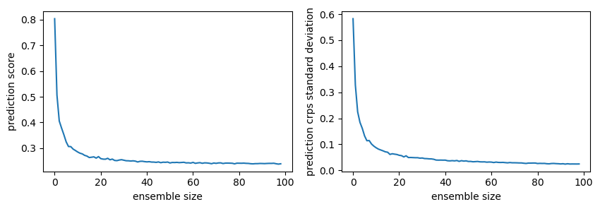
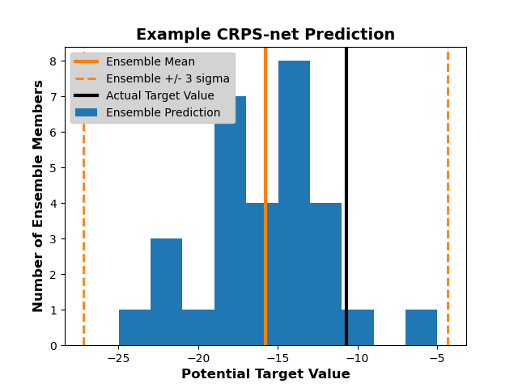

Example Usage
-------------

If you are reading this page you are likely a believer/practioner of `ensemble prediction systems <https://en.wikipedia.org/wiki/Ensemble_forecasting>`_. If you are not familiar with ensemble prediction systems I would highly recomend the following resources.

- `ECWMF Primer with weather focus <http://www.atmos.albany.edu/daes/atmclasses/atm401/pdf/14557-ecmwf-ensemble-prediction-system.pdf>`_ 
- These concepts can apply to any set of predictions where multiple equally likely predictions are made. An easy way to generate such predictions is to take a look at `this notebook <https://gitlab.tcc.li/climate/science/data-insights-discovery/weather_science/projects/complete_forecast/-/blob/master/Python/ensemble_regression.ipynb>`_ which demonstrates CRPS-Net, a new way of making probabilistic predictions! 

The code below demonstrates how to estimate the probability of some event like exceeding a threshold value or falling in some range of values, given you have an ensemble prediction. Recall that a well calibrated ensemble prediction system represents a continuum of probability and that the verifying value is equally likely to occur in any bin, where bins are defined as the space between discrete predicted values. This code figures out how to divide the probability between those members, the tails (outside of all the members), and ties between members and thresholds (trickier than it sounds). 

Calculate the CRPS-Sample score
###############################

The CRPS sample score is equivalent to mean absolute error for ensemble predictions. See examples below. Note, if you are calculating the CRPS sample score for hundreds of thousands to millions of examples, we recommend using the `properscoring package <https://pypi.org/project/properscoring/>`_ (the version in this package is designed to work as a loss function and uses lots of memory). 

.. code-block:: python

  # When Tensorflow is available in your working environment
  # it will be used for backend calculations. Predictions
  # must be np.float32 or 16 or else an error will be thrown
  y_pred = np.array([[1, 1, 1, 1, 1, 1, 1],
                     [0, 1, 1, 1, 1, 1, 1],
                     [2, 2, 2, 2, 2, 2, 2],
                     [3, 3, 3, 3, 3, 3, 3]], dtype=np.float32)

  y_true = np.array([1, 1, 1, 1]).reshape(-1, 1)

  # By default, crps_sample_score returns the mean for the batch
  # i.e. all examples mean score
  sample_mean_crps = crps_sample_score(y_true, y_pred).numpy()

  # To show the CRPS of each prediction, set batch_mean=False
  # NOTE: The second prediction has a greater error than the first
  # NOTE: due to a lone ensemble member equal to 0 rather than 1
  each_example_crps = crps_sample_score(y_true, y_pred, batch_mean=False).numpy()

  print(sample_mean_crps)
  print(each_example_crps)

.. parsed-literal::
  0.75510204
  array([0. , 0.02039, 1. , 2. ], dtype=float32)

The CRPS tends to decrease with increasing ensemble size, usually with diminishing returns once the ensemble size reaches a certain size. 

.. code-block:: python

  import matplotlib.pylab as plt
  import numpy as np
  from tcc_ensemble.crps_net import crps_sample_score

  y_true = 0

  # compare the scores of varying ensemble sizes
  # where the underlying prediction is a normal distribution
  ensemble_size = np.arange(1, 100)
  n_sizes = len(ensemble_size)
  size_mean_score = []
  size_sd_score = []

  # For a given ensemble size estimate
  # the crps-sample score, repeat n_size times
  for n in ensemble_size : 

      scores_for_size = np.zeros(1000)
      
      # repeat n_size times 
      for i in range(len(scores_for_size)) : 
          
          y_pred_norm = np.random.normal(loc=0, scale=1, size=n).astype(np.float32)
          score = crps_sample_score(y_true, y_pred_norm).numpy()
          scores_for_size[i] = score
          
      # Take the mean for the stats for a sample of this size
      size_mean_score.append(scores_for_size.mean())
      size_sd_score.append(scores_for_size.std())

  plt.figure(dpi=100, figsize=(10, 3))
  ax=plt.subplot(121)
  plt.plot(size_mean_score)
  plt.xlabel("ensemble size")
  plt.ylabel("prediction score")

  ax=plt.subplot(122)
  plt.plot(size_sd_score)
  plt.xlabel("ensemble size")
  plt.ylabel("prediction crps standard deviation")

Training a neural network with crps_sample_score_loss (so-called CRPS-Net)
##########################################################################

.. code-block:: python

  from sklearn.datasets import make_regression
  from tcc_ensemble.crps_net import crps_sample_score
  import tensorflow as tf
  import tensorflow.keras as K

  # cook up some regression data
  X, y = make_regression(n_features=4, n_informative=2,
                         random_state=0, shuffle=False)

  inputs = K.layers.Input(shape=(X.shape[1],))

  # Create the hidden layers
  x = K.layers.Dense(100, activation=tf.nn.leaky_relu)(inputs)
  x = K.layers.Dropout(0.1)(x)
  x = K.layers.Dense(100, activation=tf.nn.leaky_relu)(x)
  x = K.layers.Dropout(0.1)(x)

  # Create the distribution parameters---
  outputs = K.layers.Dense(51, name="ensemble_members")(x)

  model = K.Model(inputs=inputs, outputs=outputs)

  # Create the distribution parameters---
  outputs = K.layers.Dense(11, name="ensemble_members")(x)
  model = K.Model(inputs=inputs, outputs=outputs)

  # Compile and train
  # Obviously, in real life, set aside some validation and
  # test data... 
  opt = tf.keras.optimizers.Adam(learning_rate=0.001)
  model.compile(loss=crps_sample_score, optimizer=opt)

  # Train it!
  _ = model.fit(
      x=X,
      y=y, epochs=100,
      batch_size=16,
      verbose=0
  )

  # Make a prediction to show the nature/format of the output
  print("X[0]=", model.predict(X)[0])
  print("y[0]=" ,y[0])

  plt.hist(model.predict(X)[1], label="ensemble prediction")
  plt.axvline(x=model.predict(X)[1].mean(), c="C1", label="prediction mean")
  plt.axvline(x=y[1], c="k", label="target value")
  plt.title("Example of CRPS-net prediction")
  plt.legend()

.. parsed-literal::

  X[0]= [55.81589  46.660816 47.57 55.332935 45.48425  51.072544 54.814026
  51.43248  48.93596  47.72373  48.683598]
  y[0]= 49.822907447421905

Getting the probability of events from members
##############################################

Along with properly representing the uncertainty of your prediction system, one of the main benefits of probabilistic predictions is that you can estimate the probability of events. With deterministic predictions probabilities are always 0 or 1. For example, if y_pred=1, according to the model, there is a probability of 0 that the true result will be greater than 1.1. This is clearly overconfident. If your prediction is probabilistic, and say, y_pred=[0.7, 0.8, 0.9, 1, 1.1, 1.11], you have a sample of an underlying distribution and can estimate the probability of events with greater resolution (not just 0 and 1). 

Below are examples of calculating the probability of events given ensemble predictions (like those from CRPS-Net). 

.. code-block:: python

  import numpy as np
  from tcc_ensemble.ensemble_tools import probability_from_members

  # Say you had predictions that looked like the following ensemble members
  y_pred = np.array([[-1.0, -1.0, 0.0, 0.0, 0.1, 0.2, 0.5, 0.5, 1.0, 1.0]])

  # And you had the following event threshold. You can use probability_from_members
  # to estimate the probability of greater, greater_equal, less_equal, less given
  # your prediction
  thresh = 0.

  g = probability_from_members(thresh, y_pred, operator_str="greater")
  print(f"probability y_true > {thresh}  | y_pred =", g)

  # If you want greater or equal 
  ge = probability_from_members(thresh, y_pred, operator_str="greater_equal")
  print(f"probability y_true >= {thresh} | y_pred =", ge)

  # If you want less
  l = probability_from_members(thresh, y_pred, operator_str="less")
  print(f"probability y_true < {thresh}  | y_pred =", l)

  # If you want less or equal
  le = probability_from_members(thresh, y_pred, operator_str="less_equal")
  print(f"probability y_true <= {thresh} | y_pred =", le)

.. parsed-literal::
  probability y_true > 0.0  | y_pred = [[0.63636364]]
  probability y_true >= 0.0 | y_pred = [[0.72727273]]
  probability y_true < 0.0  | y_pred = [[0.27272727]]
  probability y_true <= 0.0 | y_pred = [[0.36363636]]

When all prediction members are equal you essentially have a deterministic prediction. This can happen when CRPS-net is VERY confident in some prediction. Only probabilities of 0 or 1 are possible. 

.. code-block:: python
  
  y_pred = np.array([[7, 7, 7, 7, 7, 7, 7, 7, 7, 7]])

  thresh = 8.
  print(probability_from_members(thresh, y_pred, operator_str="less"))

  thresh = 8.
  print(probability_from_members(thresh, y_pred, operator_str="greater"))
  
  thresh = 7.
  print(probability_from_members(thresh, y_pred, operator_str="greater"))

  print(probability_from_members(thresh, y_pred, operator_str="less"))

.. parsed-literal::
  array([[1.]])
  array([[0.]])
  array([[0.]])
  array([[0.]])

Often if can be handy to estimate the probability of the verifying value occurring between two specific values (e.g. maybe this is the range it is ok to take some action). This can be done using prob_between_values().

.. code-block:: python

  from tcc_ensemble.ensemble_tools import prob_between_values

  y_pred = np.array([[0.0, 0.0, 0.0, 0.0, 0.1, 0.2, 0.5, 0.5, 0.5, 1.]])

  # # Brackets [] are inclusive 
  print(prob_between_values(members=y_pred, lower=0.1, upper=0.5, bracket="[]"))

  # Brackets () are exclusive
  print(prob_between_values(members=y_pred, lower=0.1, upper=0.5, bracket="()"))

  # And of course they can be mixed 
  print(prob_between_values(members=y_pred, lower=0.1, upper=0.5, bracket="[)"))

  # If the range is way outside the predictions, the probability is zero
  print(prob_between_values(members=y_pred, lower=10, upper=15, bracket="[]"))

  # But if the value is outside of the prediction range, but close, there is
  # a non-zero probability of the true value falling in the range. 
  # Probabilities outside of the predicted range are estimated using
  # an assumed gumbel distribution tail.
  print(prob_between_values(members=y_pred, lower=1.1, upper=15, bracket="[]"))

.. parsed-literal::

  [[0.36363636]]
  [[0.18181818]]
  [[0.18181818]]
  [[0.]]
  [[0.06110527]]

Getting the probability of an event for a positive definite
###########################################################

When estimating probabilities for a quantity known to be a positive-definite (e.g. precip or wind speed), set `positive_definite=False`. When this is the case, probabilities of an event less than zero are not allowed. When False, A gumbel distribion long tail is used to estimate the probaility of extreme events above or below members. 

.. code-block:: python

  y_pred = np.array([[0.0, 0.0, 0.1, 0.2, 0.5, 0.5, 0.5, 1., 2, 4, 8]])

  print(probability_from_members(thresh=0, members=y_pred, operator_str="less", positive_definite=False))
  print(probability_from_members(thresh=0, members=y_pred, operator_str="less", positive_definite=True))

.. parsed-literal::

  WARNING:root:Probability of positive definite less than zero is always 0.
  [[0.08333333]]
  [[0.]]

